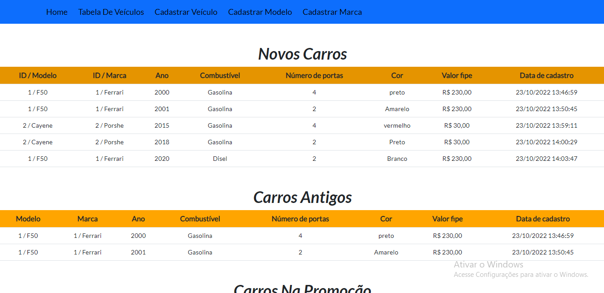
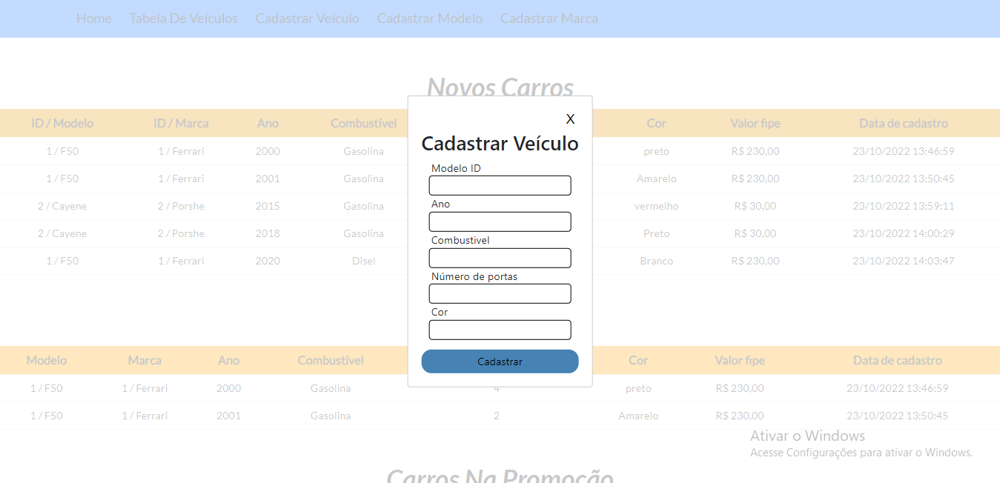

<h1 align="center">Teste Ws Work </h1>

<h2 align="center"><a href="https://veiculos-ws.netlify.app/"> 🚀 Clique Aqui Para Acessar o site 🚀</a></h2>

<h2 align="center">👁‍🗨👁‍🗨</h2>
<h3 align="center">📸Screenshot</h3>
<p>
<h1 align="center"></h1>
<h1 align="center"></h1>
<h1 align="center"></h1>


## **Sobre**

Aplicação frontend de uma listagem de carros. nesta listagem de carros contém os carros mais antigos com o ano menor que 2005, os 5 carros mais  novos que foram cadastrado recentemente e a lista da promoção que contém os carros mais baratos, e uma tabela extra que contém todos os veículos.

Todos os dados que estão nesse site vem de uma Api que eu desenvolvi com Spring-Boot e banco de dados PostgreSQL

URL do repositório da API desenvolvida - https://github.com/AAndersonSantos/API-SpringBoot

* Tecnologias Utilizadas
    * [JavaScript](https://developer.mozilla.org/pt-BR/docs/Web/JavaScript)
    * [ReactJs](https://pt-br.reactjs.org/)
    * [Sass](https://sass-lang.com/)
    * [BootStrap]()

* Principais bibliotecas que foram Utilizadas 
    * [Axios](https://www.npmjs.com/package/axios)
    * [react-modal](https://www.npmjs.com/package/react-modal)
    * [react-router-dom]()
---

<h2 align="center"> Testando o Projeto </h2>

* 1 - Para testar o projeto primeiro faça o clone do repositório utilizando a linha de comando abaixo:
```
git clone https://github.com/AAndersonSantos/Ws-Frontend.git
```
* 2 - Entre na pasta Ws-Frontend e utilize a linha de comando abaixo para fazer o download de todas as dependências necessarias para que o projeto funcione corretamente
``` 
npm install
``` 

* 3 - Utilize a linha de comando

``` 
npm start 
``` 
ou

``` 
yarn start 
``` 
para inicializar o projeto, e por último acesse o link [http://localhost:3000](http://localhost:3000) 

---

### `Erros para serem corrigidos.`

* 1 - Erro
    * No momento de fazer a persistência de um novo carro as chaves estrageiras(foreign keys) estavam sendo salvas como null, causando uma desordem no banco de dados, e assim causando erro no frontend. Correção temporaria eu retirei os campos do frontend que contém na tabela carro, os únicos dados que serão salvos na hora de cadastrar um novo carro são os da tabela marca e tabela modelo, e ao salvar não aparecerão no frontend apenas no backend.
<p>

* 2 - Adicionar funcionalidade.
    * Na hora de cadastrar um novo carro depois de clicar para cadastrar, o modal tinha que fechar automaticamente.

---

O deploy desse projeto foi realizado no [Netlify](https://www.netlify.com/)

<h2 align="center"><a href="https://veiculos-ws.netlify.app/"> 🚀 Clique Aqui Para Acessar o site 🚀</a></h2>

<h3 align="center">Criado por🤖Anderson Santos</h3>


