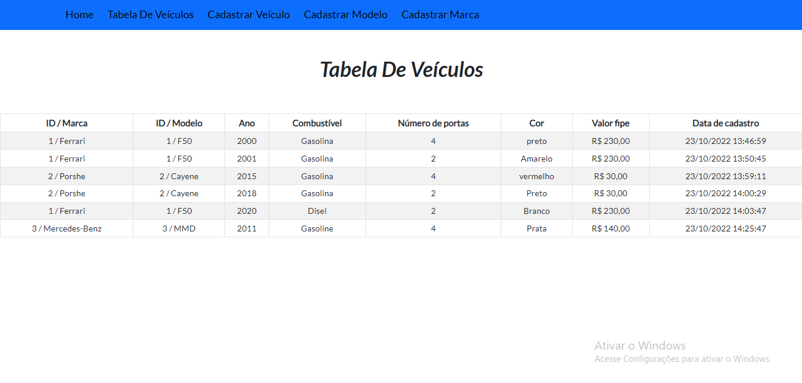

<h1 align="center">Teste Ws Work </h1>

<h2 align="center"><a href="https://petshop-online.netlify.app/"> 🚀 Clique Aqui Para Acessar o site 🚀</a></h2>

<h2 align="center">👁‍🗨👁‍🗨</h2>
<h3 align="center">📸Screenshot</h3>
<p>
<h1 align="center"></h1>
<h1 align="center"></h1>
<h1 align="center"></h1>


## **Sobre**

Nesse projeto eu desenvolvi uma página frontend de um pet shop online.

* Tecnologias Utilizadas
    * [JavaScript](https://developer.mozilla.org/pt-BR/docs/Web/JavaScript)
    * [ReactJs](https://pt-br.reactjs.org/)
    * [Sass](https://sass-lang.com/)
    * [BootStrap]()

* Principais bibliotecas que foi Utilizadas 
    * [Axios](https://www.npmjs.com/package/axios)
    * [react-modal](https://www.npmjs.com/package/react-modal)
---

<h2 align="center"> Testando o Projeto </h2>

## 1 - Primeiro Passo
Para testar o projeto primeiro faça o clone do repositório utilizando a linha de comando abaixo:
```
git clone https://github.com/AAndersonSantos/Frontend-Teste.git
```
ou faça o download do projeto em download zip.

## 2 - Segundo Passo
Entre na pasta Frontend-Teste e utilize a linha de comando abaixo para fazer o download de todas as dependências necessarias para que o projeto funcione corretamente
``` 
npm install
``` 

## 3 - Terceiro Passo
Utilize a linha de comando

``` 
npm start 
``` 
ou

``` 
yarn start 
``` 
para inicializar o projeto, e por último acesse o link [http://localhost:3000](http://localhost:3000) 

---

### `Melhorias para fazer neste projeto.`

* Responsividade
* Header, Swiper carousel
* OWL Carousel

---

O deploy desse projeto foi realizado no [Netlify](https://www.netlify.com/)

<h2 align="center"><a href="https://petshop-online.netlify.app/"> 🚀 Clique Aqui Para Acessar o site 🚀</a></h2>

<h3 align="center">Criado por🤖Anderson Santos</h3>


